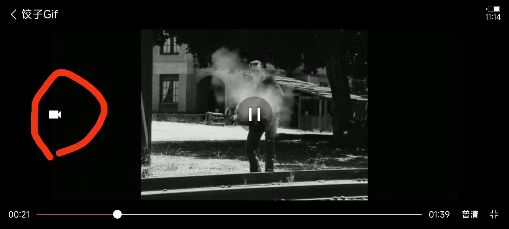

# 进阶用法

## AgVideo 完全自定义UI
## 详情页穿透
## Gif截图
开始前请先阅读 [QuickStart](quick-start.md)
### 方式一
使用demo中已封装好的组件直接使用

    前期准备：从demo中复制出JzvdStdGetGif和GifCreateHelper等类、jz_layout_gif布局文件等

接下来在布局文件中把JzvdStd替换成下面这个布局就可以直接使用gif功能了（ps：cn.jzvd.demo.CustomJzvd是demo路径需替换成你的路径）
```xml
<cn.jzvd.demo.CustomJzvd.JzvdStdGetGif
    android:id="@+id/jz_video"
    android:layout_width="match_parent"
    android:layout_height="200dp" />
```
可选：

使用这个方式来设置gif保存路径和文件名
```java
jzvdStdGetGif.setSaveGifPathName(Environment
                .getExternalStoragePublicDirectory(Environment.DIRECTORY_DCIM) + "/jiaozi-" + System.currentTimeMillis() + ".gif");
```
使用这个方式来设置gif制作结果的回调监听
```java
jzvdStdGetGif.setGifListener(new JzvdStdGetGif.GifListener() {
            @Override
            public void result(boolean success, File file) {
                if (success) {
                    //保存成功
                } else {
                    //保存失败
                }
            }
        });
```
效果图



### 方式二
自己看源码改 (ง •̀_•́)ง加油


## 列表自动播放
## 仿抖音UI
## 小窗播
